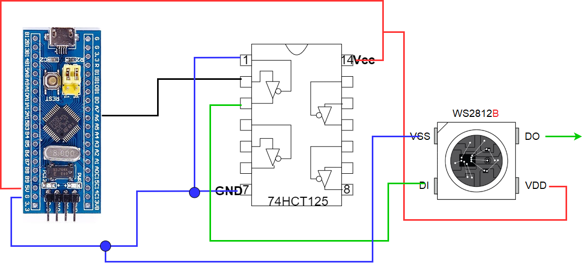

# WS2812B and STM32F103C8 very simple project

STM32F103C8 use TIM3 for generate serial data for 8 diodes WS2812B

This project was implemented using project:
https://forbot.pl/blog/kurs-stm32l4-diody-rgb-ws2812b-liczniki-quiz-id49890

This is a phto of real working circuit:

